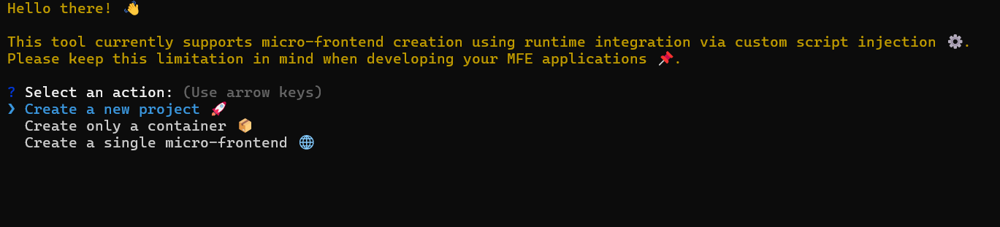

# React Microfront end generator (react-mfe-gen)

<strong style="color:orange">⚠️ Important:</strong> Install this package globally using `npm install -g` to use the CLI anywhere on your system.

react-mfe-gen is a CLI tool that helps you quickly scaffold a base setup for React Micro-Frontend (MFE) architecture.

This tool uses the Runtime Integration approach — meaning each MFE is built as a Web Component and integrated dynamically at runtime. This keeps your applications modular, scalable, and independent.

## Features:

- Spin up a React Microfrontend Base in Seconds – No hassle, just code.
- Built on Runtime Integration Best Practices – Seamless, scalable, and future-proof.
- Generates Production-Ready Microfrontends – Pre-configured and good to go.
- Smart Library Installer – Dynamically adds state management, styling, and form tools based on your choices.
- Self-Healing Setup – Auto-cleans incomplete code if something breaks mid-process.
- True Cross-Platform Compatibility – Works flawlessly on Windows, macOS, and Linux.

## Prerequisites:

Node.js installed (latest LTS recommended).

## Installation & Usage:

- Install the package globally
    `npm install -g react-mfe-gen`

- Run the CLI
    `create-react-mfe`

- You will see the below message in your terminal

- Answer the prompts to generate your project, container, or micro-frontend.